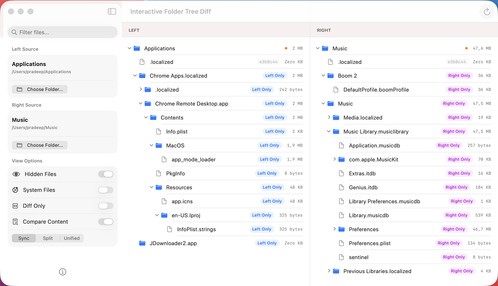

# Interactive Folder Diff

A beautiful, native macOS application for comparing and synchronizing folders with an intuitive visual interface. Built with SwiftUI and designed for developers, designers, and anyone who needs to compare directory structures.


---

## 📸 Screenshot



---

## ✨ Features

### 🔍 **Smart Comparison**
- **Visual Diff**: Side-by-side or unified view of folder differences
- **Content Verification**: SHA256 hash comparison for files with identical sizes
- **Filter Options**: Show/hide hidden files and system files
- **Diff-Only Mode**: Focus on differences by hiding unchanged files
- **Real-time Search**: Filter files and folders as you type

### 🎨 **Multiple View Modes**
- **Sync View**: Classic side-by-side comparison
- **Git Split**: Git-style split view with clear visual indicators
- **Git Unified**: Single-pane unified diff view

### 🚀 **File Operations**
- **Drag & Drop**: Simply drag folders into the sidebar
- **Copy Files**: Copy individual files or entire directories
- **Progress Tracking**: Real-time progress for copy operations
- **Batch Operations**: Sync entire folder structures

### 💎 **Modern UI**
- Native macOS design with SwiftUI
- Dark mode support
- Responsive layout
- Smooth animations
- Material effects

---

## 🛠️ System Requirements

- **macOS**: 14.0 (Sonoma) or later
- **Architecture**: Apple Silicon (M1/M2/M3) or Intel
- **Disk Space**: ~10 MB

---

## 📦 Installation

### ⚡ Quick Install (Recommended)

**Download the pre-built app and start using it immediately:**

1. **Download the latest release**
   - Go to the [**Releases**](https://github.com/nginxdev/interactive-folder-diff-swift/releases) page
   - Download `InteractiveFolderDiff.app.zip` from the latest release

2. **Install the app**
   - Unzip the downloaded file (double-click the `.zip` file)
   - Drag `InteractiveFolderDiff.app` to your **Applications** folder

3. **First launch**
   - Open **Applications** folder
   - Right-click on `InteractiveFolderDiff.app` and select **Open**
   - Click **Open** in the security dialog (required for first launch only)
   - The app will launch and you're ready to go!

> **Note**: If you see a security warning, go to **System Settings** → **Privacy & Security** and click **Open Anyway** next to the app name.

---

### 🔨 Build from Source

**For developers who want to build the app themselves:**

#### Prerequisites
- Xcode 15.0 or later
- Swift 6.0 or later
- macOS 14.0 or later

#### Option 1: Command Line Build

```bash
# Clone the repository
git clone https://github.com/nginxdev/interactive-folder-diff-swift.git
cd interactive-folder-diff-swift

# Build the release version
swift build -c release

# The binary will be in .build/release/InteractiveFolderDiff
# Run it directly
.build/release/InteractiveFolderDiff
```

#### Option 2: Build with Swift Package Manager

```bash
# Clone the repository
git clone https://github.com/nginxdev/interactive-folder-diff-swift.git
cd interactive-folder-diff-swift

# Build and run
swift run
```

#### Option 3: Build with Xcode

```bash
# Clone the repository
git clone https://github.com/nginxdev/interactive-folder-diff-swift.git
cd interactive-folder-diff-swift

# Open in Xcode
open Package.swift
```

Then in Xcode:
1. Wait for dependencies to resolve
2. Select **My Mac** as the destination
3. Press **⌘R** to build and run
4. Or press **⌘B** to build only

To create an app bundle:
1. In Xcode, go to **Product** → **Archive**
2. Click **Distribute App** → **Copy App**
3. Save the `.app` bundle to your desired location

---

## 🎯 How to Use

### Getting Started

#### 1️⃣ **Launch the Application**
- Open `InteractiveFolderDiff.app` from your Applications folder
- You'll see a three-panel interface: sidebar (left), and main comparison area (right)

#### 2️⃣ **Select Folders to Compare**

**Method A: Using the Folder Picker**
1. In the sidebar, find the **Left Source** section
2. Click the **"Choose Folder..."** button
3. Navigate to and select your first folder
4. Repeat for **Right Source** section with your second folder

**Method B: Drag and Drop**
1. Open Finder and locate your first folder
2. Drag the folder onto the **Left Source** area in the sidebar
3. Repeat for the second folder onto the **Right Source** area

> 💡 **Tip**: The app will automatically start comparing as soon as both folders are selected!

---

### 3️⃣ **Configure Comparison Options**

In the **View Options** section of the sidebar, you can customize what to show:

| Option | What it does | When to use |
|--------|--------------|-------------|
| **Hidden Files** | Shows/hides files starting with `.` (like `.git`, `.env`) | Enable when you need to compare hidden config files |
| **System Files** | Shows/hides macOS system files (`.DS_Store`, etc.) | Usually keep disabled to reduce noise |
| **Diff Only** | Hides files that are identical in both folders | Enable to focus only on differences |
| **Compare Content** | Uses SHA256 hash to verify file contents | Enable for accurate comparison (slower but thorough) |

**Understanding Compare Content:**
- **OFF** (default): Only compares file sizes - fast but may miss identical-sized files with different content
- **ON**: Calculates SHA256 hash for files with same size - slower but 100% accurate

---

### 4️⃣ **Choose Your View Mode**

Select from three view modes using the segmented control in the sidebar:

#### **Sync Mode**
- Traditional side-by-side comparison
- Left folder on the left, right folder on the right
- Best for: General comparison and syncing

#### **Git Split Mode**
- Git-style split view with enhanced visual indicators
- Shows file status with colors and icons
- Best for: Developers familiar with Git workflows

#### **Git Unified Mode**
- Single-pane view showing merged structure
- Files marked with status indicators
- Best for: Reviewing overall differences in one view

---

### 5️⃣ **Navigate and Search**

**Expanding Folders:**
- Click on any folder to expand/collapse it
- See the full directory tree structure
- Folders with differences are highlighted

**Searching:**
- Click the search field in the sidebar (or press **⌘F**)
- Type to filter files and folders by name
- Search is case-insensitive and matches partial names
- Clear search to see all files again

**Understanding Colors:**
- 🟢 **Green**: File/folder is unchanged (identical)
- 🔴 **Red**: File/folder removed (exists in left only)
- 🟡 **Yellow/Orange**: File/folder added (exists in right only)
- 🔵 **Blue**: File/folder modified (exists in both but different)
- ⚠️ **Gray**: Error accessing file/folder

---

### 6️⃣ **Perform File Operations**

**Copying Files:**
1. Right-click on any file or folder
2. Select from the context menu:
   - **Copy to Right** - Copies from left to right folder
   - **Copy to Left** - Copies from right to left folder
   - **Reveal in Finder** - Opens the file location in Finder

**Tracking Progress:**
- When copying, a progress bar appears at the bottom
- Shows current file being copied
- Displays percentage complete and data transferred
- See item count and total size

**Refreshing:**
- Click the **Refresh** button (↻) in the toolbar
- Or press **⌘R**
- Rescans both folders and updates the comparison

---

### 7️⃣ **Keyboard Shortcuts**

| Shortcut | Action |
|----------|--------|
| **⌘F** | Focus search field |
| **⌘R** | Refresh comparison |
| **⌘W** | Close window |
| **⌘Q** | Quit application |
| **⌘,** | Open preferences (if available) |
| **Space** | Quick Look selected file |

---

## 💡 Usage Examples

### Example 1: Comparing Project Backups
```
Use Case: You have two versions of a project and want to see what changed

1. Select your old project folder as Left Source
2. Select your new project folder as Right Source
3. Enable "Diff Only" to see only changes
4. Enable "Compare Content" for accurate comparison
5. Review modified files (blue) and new files (yellow)
```

### Example 2: Syncing Folders
```
Use Case: You want to sync files from one folder to another

1. Select source folder as Left Source
2. Select destination folder as Right Source
3. Enable "Diff Only" to see what needs syncing
4. Right-click files marked as "Removed" (red) and select "Copy to Right"
5. Monitor progress in the bottom overlay
```

### Example 3: Finding Duplicate Files
```
Use Case: Check if two folders contain the same files

1. Select both folders
2. Enable "Compare Content" for hash-based comparison
3. Enable "Diff Only"
4. Any remaining files are different or unique to one folder
5. Files shown in green (if any) are identical
```

---

## 🏗️ Technical Architecture

The application follows a clean **MVVM** (Model-View-ViewModel) architecture:

```
Sources/FolderCompareApp/
├── FolderCompareApp.swift      # App entry point
├── Models/
│   └── FileNode.swift          # File/folder data model with diff status
├── Services/
│   └── FileSystemService.swift # File operations & comparison algorithms
├── ViewModels/
│   └── CompareViewModel.swift  # Business logic & state management
└── Views/
    ├── ContentView.swift       # Main UI layout & navigation
    ├── FileRowView.swift       # Individual file/folder row
    └── TreeView.swift          # Recursive tree view component
```

### Key Components

| Component | Responsibility |
|-----------|----------------|
| **FileNode** | Represents files/folders in a tree structure with diff status |
| **FileSystemService** | Handles scanning, SHA256 hashing, and file operations |
| **CompareViewModel** | Manages app state, coordinates views and services |
| **TreeView** | Recursive SwiftUI view for displaying folder hierarchies |

---

## 🔧 Advanced Configuration

### Comparison Strategies

The app uses intelligent comparison logic:

1. **Quick Check**: Compares file sizes first (instant)
2. **Deep Check**: If sizes match and "Compare Content" is enabled, calculates SHA256 hashes
3. **Type Check**: Ensures both items are the same type (file vs directory)

### Performance Tips

- **Large folders**: Disable "Compare Content" for faster initial scan
- **Many files**: Use "Diff Only" to reduce visual clutter
- **Network drives**: Expect slower performance due to network latency
- **SSD vs HDD**: SSDs will provide significantly faster scanning

---

## 🤝 Contributing

Contributions are welcome! Here's how you can help:

### Reporting Bugs
1. Check if the issue already exists in [Issues](https://github.com/nginxdev/interactive-folder-diff-swift/issues)
2. Create a new issue with:
   - Clear description of the problem
   - Steps to reproduce
   - Expected vs actual behavior
   - macOS version and app version

### Suggesting Features
1. Open a new issue with the `enhancement` label
2. Describe the feature and use case
3. Explain why it would be useful

### Submitting Code
1. Fork the repository
2. Create a feature branch (`git checkout -b feature/AmazingFeature`)
3. Make your changes
4. Test thoroughly
5. Commit with clear messages (`git commit -m 'Add amazing feature'`)
6. Push to your fork (`git push origin feature/AmazingFeature`)
7. Open a Pull Request

---

## 📝 License

This project is licensed under the **MIT License** - see the [LICENSE](LICENSE) file for details.

**TL;DR**: You can use, modify, and distribute this software freely, even for commercial purposes.

---

## 👨‍💻 Author

**nginxdev**
- GitHub: [@nginxdev](https://github.com/nginxdev)
- Made with ❤️ in Berlin

---

## 🙏 Acknowledgments

- Built with [SwiftUI](https://developer.apple.com/xcode/swiftui/) - Apple's modern UI framework
- Uses [CryptoKit](https://developer.apple.com/documentation/cryptokit) for SHA256 hashing
- Inspired by traditional diff tools (diff, Beyond Compare) and Git's diff visualization

---

## 🐛 Known Issues & Limitations

- **Large files**: Hashing very large files (>1GB) may take time
- **Symlinks**: Currently follows symlinks (may cause issues with circular references)
- **Permissions**: Requires read access to both folders

Report issues on the [Issues page](https://github.com/nginxdev/interactive-folder-diff-swift/issues).

---

## 🗺️ Roadmap

Future features planned:

- [ ] **Export Reports**: Generate HTML, Markdown, or JSON diff reports
- [ ] **File Preview**: Quick Look integration for file content preview
- [ ] **Three-Way Merge**: Compare three folders simultaneously
- [ ] **Ignore Patterns**: Support for `.gitignore`-style exclusion rules
- [ ] **Bookmarks**: Save and quickly access favorite folder pairs
- [ ] **CLI Tool**: Command-line interface for automation
- [ ] **Preferences**: Persistent settings and customization options
- [ ] **Themes**: Additional color schemes and UI customization
- [ ] **File Filters**: Filter by file type, size, or date
- [ ] **Batch Operations**: Queue multiple copy/sync operations

---

## 📚 FAQ

### General Questions

**Q: Is this app free?**  
A: Yes! It's completely free and open source under the MIT license.

**Q: Does this app modify my files?**  
A: The app only modifies files when you explicitly use copy/sync operations. Comparison is completely read-only and safe.

**Q: Where is my data stored?**  
A: All operations are performed locally on your Mac. No data is sent to external servers or cloud services.

**Q: Can I use this for work/commercial projects?**  
A: Absolutely! The MIT license allows commercial use.

---

### Technical Questions

**Q: How does content comparison work?**  
A: When enabled, the app calculates SHA256 hashes for files with identical sizes. This ensures files are truly identical, not just the same size.

**Q: Why is content comparison slower?**  
A: SHA256 hashing requires reading the entire file content, which takes time for large files. Size-only comparison is instant.

**Q: Can I compare network drives or cloud storage?**  
A: Yes, as long as the folders are mounted and accessible via Finder (e.g., SMB shares, iCloud Drive, Dropbox).

**Q: What about symbolic links?**  
A: The app currently follows symbolic links. Be careful with circular references.

**Q: Does it work with external drives?**  
A: Yes! Works with any mounted volume accessible to macOS.

---

### Troubleshooting

**Q: The app won't open / shows security warning**  
A: Right-click the app and select "Open", then click "Open" in the dialog. Or go to System Settings → Privacy & Security and click "Open Anyway".

**Q: Comparison is very slow**  
A: Try disabling "Compare Content" for faster scanning. Also check if you're comparing network drives or very large folders.

**Q: Some files show as "Failure"**  
A: This usually means permission issues. Make sure you have read access to all files in both folders.

**Q: The app crashes when comparing large folders**  
A: Please report this as a bug with details about folder size and macOS version.

---

## 📞 Support

- **Bug Reports**: [GitHub Issues](https://github.com/nginxdev/interactive-folder-diff-swift/issues)
- **Feature Requests**: [GitHub Issues](https://github.com/nginxdev/interactive-folder-diff-swift/issues)
- **Discussions**: [GitHub Discussions](https://github.com/nginxdev/interactive-folder-diff-swift/discussions)

---

## ⭐ Show Your Support

If you find this app useful, please consider:
- ⭐ **Starring** this repository
- 🐛 **Reporting bugs** to help improve the app
- 💡 **Suggesting features** you'd like to see
- 🔀 **Contributing** code or documentation
- 📢 **Sharing** with others who might find it useful

---

**Thank you for using Interactive Folder Diff!** 🎉
